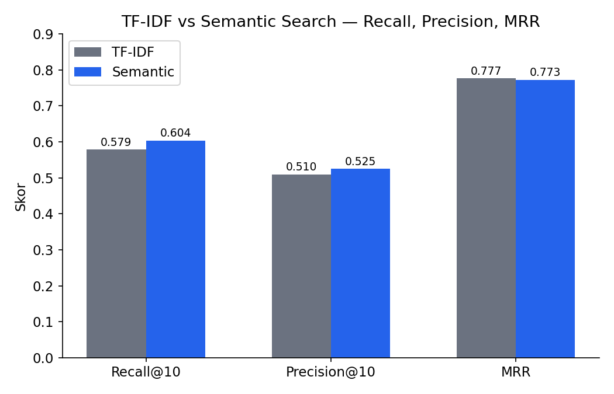
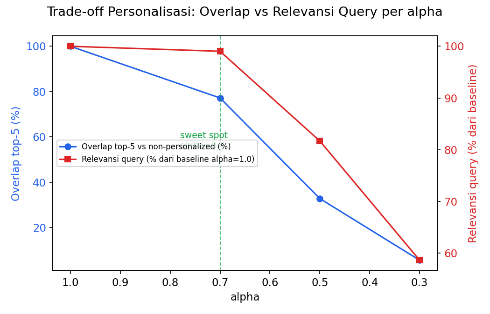

# **Semantic Search untuk Merchant**
### Search & Discovery berbasis Embedding, Olist Brazilian E-Commerce Dataset

> Proyek ini membangun dua mesin pencari untuk katalog merchant e-commerce, lalu membandingkan keduanya: pencarian kata kunci (TF-IDF) dan pencarian makna (semantic search berbasis embedding). Dataset Olist tidak punya deskripsi merchant, jadi langkah pertama proyek ini menyusun ulang profil teks tiap seller dari data transaksi. Hasilnya: perbandingan dua engine di 110 query, plus fitur personalisasi yang menyesuaikan hasil dengan histori belanja pelanggan.

## Daftar Isi

1. [Latar Belakang & Business Questions](#1-latar-belakang--business-questions)
2. [Sumber Data](#2-sumber-data)
3. [Metodologi / Alur Kerja](#3-metodologi--alur-kerja)
4. [Tech Stack](#4-tech-stack)
5. [Cara Kerja Tiap Algoritma](#5-cara-kerja-tiap-algoritma)
   - [5.1 TF-IDF](#51-tf-idf)
   - [5.2 Cosine similarity](#52-cosine-similarity)
   - [5.3 Semantic search](#53-semantic-search)
   - [5.4 Personalisasi](#54-personalisasi)
6. [Cara Mengukur Hasilnya](#6-cara-mengukur-hasilnya)
   - [6.1 Recall@K](#61-recallk)
   - [6.2 Precision@K](#62-precisionk)
   - [6.3 MRR (Mean Reciprocal Rank)](#63-mrr-mean-reciprocal-rank)
7. [Hasil & Insight Kunci](#7-hasil--insight-kunci)
   - [7.1 BQ1: Seberapa sering pengguna gagal menemukan merchant?](#71-business-question-1--seberapa-sering-pengguna-gagal-menemukan-merchant-yang-mereka-cari)
   - [7.2 BQ2: Apakah mesin pencari berbasis makna membantu?](#72-business-question-2--apakah-mesin-pencari-berbasis-makna-membantu-pengguna-lebih-baik)
   - [7.3 BQ3: Bisakah hasil dipersonalisasi tanpa merusak relevansi?](#73-business-question-3--bisakah-hasil-disesuaikan-per-pelanggan-tanpa-merusak-relevansi)
8. [Kesimpulan](#8-kesimpulan)
9. [Rekomendasi](#9-rekomendasi)
10. [Batasan & Keterbatasan Proyek](#10-batasan--keterbatasan-proyek)
11. [Cara Menjalankan](#11-cara-menjalankan)
12. [Struktur Proyek](#12-struktur-proyek)
13. [Pengembangan Lanjutan](#13-pengembangan-lanjutan)
14. [Referensi](#14-referensi)

## 1. Latar Belakang & Business Questions

Pencarian kata kunci cuma cocok kalau kata di query sama persis dengan kata di teks yang dicari. Query "perlengkapan bayi murah" bisa gagal menemukan merchant yang relevan kalau profilnya ditulis dengan kata lain. Semantic search mengatasi ini dengan mencocokkan makna, bukan kata per kata. Keterbatasan pencocokan literal ini dan manfaat menggabungkannya dengan pencocokan berbasis makna (semantic) juga ditunjukkan pada studi retrieval dokumen berskala besar, yang menjadi salah satu dasar rekomendasi hybrid TF-IDF + semantic di proyek ini (Kuzi et al., 2020).

Tiga pertanyaan yang dijawab proyek ini:

| # | Pertanyaan | Diukur pakai |
|---|---|---|
| BQ1 | Seberapa sering pengguna gagal menemukan merchant yang mereka cari lewat pencarian saat ini? | Recall@10 dan studi kasus kualitatif pada TF-IDF |
| BQ2 | Kalau mesin pencari diganti ke yang berbasis makna (bukan kata kunci), apakah pengguna lebih sering menemukan merchant yang relevan? | Recall@10, Precision@10, MRR — TF-IDF vs semantic |
| BQ3 | Bisakah urutan hasil pencarian disesuaikan dengan kebiasaan belanja tiap pelanggan, tanpa membuat hasilnya kurang relevan? | Overlap top-5 vs skor relevansi query, di berbagai nilai `alpha`, untuk satu query uji ("produk elektronik") pada engine semantic |

## 2. Sumber Data

[Olist Brazilian E-Commerce (Kaggle)](https://www.kaggle.com/datasets/olistbr/brazilian-ecommerce): 9 tabel CSV (customers, orders, order_items, order_payments, order_reviews, products, sellers, geolocation, category_translation). Data seller cuma berisi `seller_id`, kode pos, kota, dan provinsi  tidak ada nama atau deskripsi toko. Karena itu, profil teks tiap merchant harus disusun dari riwayat transaksinya, bukan diambil langsung dari data.

## 3. Metodologi / Alur Kerja

| Tahap | Isi | Output kunci |
|---|---|---|
| 1. Setup & load data | Baca 9 CSV Olist | 9 DataFrame mentah |
| 2. Tantangan data | Cek struktur `sellers`: tidak ada nama/deskripsi | Justifikasi rekonstruksi profil |
| 3. Bangun profil teks merchant | Gabungkan order_items → products → kategori (EN→ID) → orders → reviews → sellers, lalu susun jadi kalimat per seller (min. 3 order) | 2.138 profil merchant siap diembed |
| 4. Baseline TF-IDF | `TfidfVectorizer` (unigram+bigram) + cosine similarity | Engine TF-IDF, vocab 5.281 term |
| 5. Semantic search | `sentence-transformers` (`paraphrase-multilingual-MiniLM-L12-v2`) + FAISS `IndexFlatIP`, fallback otomatis ke TF-IDF+SVD kalau tidak ada internet | Engine semantic |
| 6. Bandingkan engine | 3 query bahasa sehari-hari dicoba di kedua engine | Studi kasus kualitatif |
| 7. Evaluasi kuantitatif | Ground truth sintetis dari taksonomi kategori (110 query), hitung Recall@10 / Precision@10 / MRR | Tabel & chart perbandingan |
| 8. Personalisasi | Gabungkan skor query (engine semantic) dengan skor histori kategori pelanggan (≥2 order), untuk 1 query uji ("produk elektronik") | Evaluasi trade-off relevansi vs personalisasi |

Model embedding multibahasa yang dipakai di tahap 5 (`paraphrase-multilingual-MiniLM-L12-v2`) berasal dari pendekatan knowledge distillation yang memetakan kalimat lintas bahasa ke ruang vektor yang sama, sehingga kalimat dengan makna serupa saling berdekatan meski bahasanya berbeda (Reimers & Gurevych, 2020).

## 4. Tech Stack

- Python: pandas, numpy
- Search: scikit-learn (`TfidfVectorizer`, cosine similarity), `sentence-transformers` (`paraphrase-multilingual-MiniLM-L12-v2`), FAISS (`IndexFlatIP`)
- Evaluasi: Recall@K, Precision@K, MRR, dihitung manual dari ground truth sintetis
- Visualisasi: matplotlib
- Demo terpisah: Streamlit (`app.py`, di luar notebook ini)

## 5. Cara Kerja Tiap Algoritma

### 5.1 TF-IDF
Cara kerjanya: kata yang sering muncul di satu profil merchant tapi jarang muncul di profil lain dianggap penting untuk profil itu. Kata umum yang muncul di hampir semua profil (seperti "produk" atau "bagus") dianggap kurang penting.

```
tfidf(t, d) = tf(t, d) × log(N / df(t))
```

`tf(t, d)`: berapa kali kata `t` muncul di dokumen `d`. `N`: jumlah total dokumen. `df(t)`: di berapa dokumen kata itu muncul. Query dan profil merchant diubah jadi angka pakai rumus ini, lalu dibandingkan pakai cosine similarity.

### 5.2 Cosine similarity 
Ini rumus yang dipakai TF-IDF dan semantic search untuk mengukur "seberapa mirip" dua teks setelah diubah jadi angka (vektor):

```
cos(A, B) = (A · B) / (‖A‖ × ‖B‖)
```

Intinya: mengukur arah, bukan panjang. Teks panjang dan teks pendek dengan isi mirip tetap dianggap mirip, karena yang dibandingkan cuma arahnya.

### 5.3 Semantic search

Query dan profil merchant diubah jadi angka pakai model AI (`paraphrase-multilingual-MiniLM-L12-v2`), bukan dihitung dari kemunculan kata seperti TF-IDF. Model ini sudah dilatih supaya kalimat dengan arti mirip menghasilkan angka yang berdekatan, walau kata-katanya beda — lewat proses knowledge distillation dari model monolingual berbahasa Inggris ke ruang vektor multibahasa (Reimers & Gurevych, 2020), sehingga model ini bisa dipakai untuk profil dan query berbahasa Indonesia meski data latihan aslinya didominasi bahasa Inggris. FAISS (`IndexFlatIP`) dipakai untuk mencari kecocokan dengan cepat  hasilnya setara dengan cosine similarity, tapi jauh lebih efisien kalau datanya besar.

### 5.4 Personalisasi

Skor akhir tiap merchant adalah campuran dua hal: relevansi terhadap query, dan kecocokan dengan kebiasaan belanja pelanggan.

```
final_score = alpha × score_query + (1 - alpha) × score_history
```

`alpha` mengatur porsi campurannya. `alpha = 1.0` berarti murni relevansi query, tanpa personalisasi. Makin kecil `alpha`, makin besar pengaruh histori pelanggan.

## 6. Cara Mengukur Hasilnya

Tiga metrik ini dihitung dari 110 query ground truth sintetis:

### 6.1 Recall@K
Dari semua merchant yang seharusnya muncul, berapa persen yang benar-benar masuk ke K hasil teratas. Recall rendah berarti banyak merchant relevan yang terlewat.

```
Recall@K = (merchant relevan yang masuk top-K) / (total merchant relevan)
```

### 6.2 Precision@K

Dari K hasil yang ditampilkan, berapa persen yang benar-benar relevan. Precision rendah berarti banyak hasil yang "nyasar".

```
Precision@K = (merchant relevan yang masuk top-K) / K
```

### 6.3 MRR (Mean Reciprocal Rank)
Seberapa cepat hasil yang relevan muncul, dirata-rata dari semua query. MRR tinggi berarti hasil paling relevan biasanya muncul di urutan atas, bukan terkubur di posisi bawah.

```
MRR = (1 / |Q|) × Σ (1 / rank_i)
```

`|Q|`: jumlah query. `rank_i`: posisi hasil relevan pertama untuk query ke-`i`.

## 7. Hasil & Insight Kunci

### 7.1 Business Question 1  seberapa sering pengguna gagal menemukan merchant yang mereka cari?

TF-IDF melewatkan rata-rata ~42% merchant relevan di top-10 (Recall@10 = 0,579). Kegagalannya bukan cuma "tidak ketemu"  kadang TF-IDF malah salah arah kalau ada kata yang kebetulan sama tapi maksudnya beda. Contoh: query "biar kerja dari rumah makin nyaman" nyasar ke kategori "material konstruksi rumah", gara-gara kata "rumah".

### 7.2 Business Question 2  apakah mesin pencari berbasis makna membantu pengguna lebih baik?



| Engine | Recall@10 | Precision@10 | MRR |
|---|---|---|---|
| TF-IDF | 0,579 | 0,510 | 0,777 |
| Semantic | 0,604 | 0,525 | 0,773 |

Semantic search menang di recall dan precision (naik 2,5 dan 1,5 poin), tapi MRR-nya sedikit kalah  TF-IDF masih sedikit lebih jago menaruh hasil terbaik di posisi #1. Selisihnya nyata tapi tidak besar, karena ground truth dibuat dari kata kunci kategori yang sama persis dengan teks profil merchant, jadi menguntungkan TF-IDF yang mengandalkan kecocokan kata.

Semantic search juga tidak selalu menang. Performanya tergantung seberapa dekat kata-kata di query dengan kosakata yang ada di profil merchant.

### 7.3 Business Question 3  bisakah hasil disesuaikan per pelanggan tanpa merusak relevansi?

**Cakupan pengujian:** trade-off ini diukur pada 50 pelanggan (yang punya histori ≥2 order) dan 4 nilai `alpha`, tapi seluruhnya untuk **satu query uji** ("produk elektronik") dan **satu engine** (semantic). Ini cukup untuk melihat pola trade-off secara terukur (bukan cuma 1 contoh anekdotal seperti demo awal), tapi belum berarti pola ini pasti sama untuk query lain atau untuk TF-IDF  lihat Batasan poin 4.



| alpha | Overlap top-5 vs non-personalized | Relevansi query |
|---|---|---|
| 1,0 | 100% | 0,928 |
| 0,7 | 77,2% | 0,919 (turun 1%) |
| 0,5 | 32,8% | 0,758 (turun 18%) |
| 0,3 | 5,6% | 0,544 (turun 41%) |

`alpha ≈ 0,7` adalah titik paling seimbang: 23% hasil sudah bergeser ke preferensi pelanggan, tapi relevansi query nyaris tidak turun (~1%). Di bawah `alpha = 0,5`, relevansi mulai anjlok.

Catatan penting: fitur ini baru bisa dipakai untuk 2.876 dari 99.441 pelanggan (2,9%) yang punya histori ≥2 order. Sebagian besar pelanggan Olist cuma belanja sekali, jadi >97% pelanggan belum bisa menikmati personalisasi ini.

## 8. Kesimpulan

Ketiga business question di Bagian 1 terjawab dengan hasil yang konsisten satu sama lain:

1. **Pencarian kata kunci saat ini memang bermasalah.** TF-IDF melewatkan hampir separuh (~42%) merchant relevan di top-10, dan sebagian kegagalannya bukan cuma "tidak ketemu" tapi "salah arah"  nyasar ke kategori yang tidak relevan gara-gara kebetulan ada kata yang sama. Ini mengonfirmasi masalah awal yang mendasari proyek: pencocokan kata literal tidak cukup untuk query bahasa sehari-hari.
2. **Semantic search terbukti lebih baik, tapi bukan solusi mutlak.** Recall@10 dan Precision@10 naik masing-masing 2,5 dan 1,5 poin dibanding TF-IDF, namun MRR-nya sedikit lebih rendah  TF-IDF masih sedikit unggul menaruh hasil terbaik di posisi #1. Selisih yang tidak besar ini sebagian disebabkan ground truth yang dibuat dari kata kunci kategori, sehingga secara struktural menguntungkan TF-IDF. Kesimpulannya: semantic search adalah peningkatan yang nyata, tapi kekuatannya baru maksimal kalau digabung dengan TF-IDF (hybrid), bukan menggantikannya sepenuhnya.
3. **Personalisasi berbasis histori belanja bisa dilakukan tanpa mengorbankan relevansi  asal di rentang `alpha` yang tepat.** Pada `alpha ≈ 0,7`, hasil sudah cukup bergeser ke preferensi pelanggan (23% top-5 berubah) sementara relevansi query nyaris tidak turun (~1%). Di bawah `alpha = 0,5`, trade-off berbalik cepat dan relevansi anjlok. Tapi manfaat ini masih sangat terbatas cakupannya: baru 2,9% pelanggan Olist yang punya histori order cukup untuk dipersonalisasi, dan pola `alpha` ini baru diuji pada satu query dan satu engine.

Secara keseluruhan, proyek ini menunjukkan bahwa peralihan dari pencarian berbasis kata kunci ke pencarian berbasis makna adalah langkah yang tervalidasi secara terukur, dengan personalisasi sebagai lapisan tambahan yang aman diterapkan pada rentang `alpha` yang sudah diketahui  dengan catatan bahwa cakupan pengujian personalisasi dan porsi pelanggan yang bisa dijangkau keduanya masih perlu diperluas sebelum rollout penuh (lihat Rekomendasi dan Batasan).

## 9. Rekomendasi

Tiap rekomendasi di bawah menjawab salah satu business question di Bagian 1.

**Untuk BQ 1 & 2  kualitas pencarian:**

1. Gabungkan TF-IDF dan semantic jadi satu (hybrid), jangan pilih salah satu. Semantic menambal miss TF-IDF, TF-IDF menambal salah arah semantic saat kosakata query jauh dari profil merchant  pendekatan hybrid seperti ini konsisten dengan temuan bahwa pencocokan semantic dan leksikal saling melengkapi, bukan saling menggantikan (Kuzi et al., 2020).
2. Tulis profil merchant dengan kalimat yang lebih natural, bukan template kaku, supaya model semantic punya lebih banyak "bahan" untuk memahami makna  ini langsung menaikkan recall semantic (BQ2) dan mengurangi salah arah TF-IDF (BQ1).

**Untuk BQ 3  personalisasi:**

3. Pakai `alpha` di kisaran 0,6–0,8, bukan asal pasang 0,7 tanpa dites  rentang ini menjaga relevansi query tetap turun di bawah ~5%, berdasarkan hasil pada query uji di atas.
4. Sebelum rollout, ulangi pengujian trade-off `alpha` di beberapa query lain (bukan cuma "produk elektronik") untuk memastikan titik seimbang 0,6–0,8 juga berlaku di sana.
5. Buat cara personalisasi lain berbasis aktivitas sesi (kategori yang sedang dilihat/diklik), khusus untuk >97% pelanggan yang belum punya histori order dan belum kejangkau blending `alpha`.

## 10. Batasan & Keterbatasan Proyek

1. Ground truth evaluasi (Recall@K/Precision@K/MRR) masih dibuat sintetis dari taksonomi kategori, bukan dari log pencarian pengguna asli.
2. Profil merchant hasil rekonstruksi dari data transaksi, bukan deskripsi asli yang ditulis merchant.
3. ~31% seller (957 dari 3.095) tidak masuk pencarian karena order-nya kurang dari 3  datanya terlalu sedikit untuk bikin profil yang representatif.
4. Evaluasi trade-off personalisasi di bagian 7.3, meski terukur lintas 50 pelanggan × 4 nilai alpha, baru dicoba pada **1 query** ("produk elektronik") dan **1 engine** (semantic)  belum divariasikan ke query atau engine lain.

## 11. Cara Menjalankan

1. Taruh 9 file CSV Olist di folder `data/` (satu level di atas atau sejajar dengan folder `notebooks/`).
2. Install dependency:
   ```bash
   pip install pandas numpy scikit-learn sentence-transformers faiss-cpu matplotlib
   ```
3. Jalankan notebook `semantic_search_merchant.ipynb` dari atas ke bawah (Run All). Kalau tidak ada akses internet ke `huggingface.co`, engine semantic otomatis pindah ke TF-IDF+SVD (LSA)  tetap jalan, tapi kualitasnya lebih rendah dari model transformer asli.
4. (Opsional) jalankan demo interaktif terpisah:
   ```bash
   streamlit run app.py
   ```

## 12. Struktur Proyek

```
.
├── data/                              # 9 CSV Olist (tidak disertakan di repo)
├── notebooks/
│   └── semantic_search_merchant.ipynb # notebook utama (pipeline + evaluasi + insight)
├── assets/                            # chart hasil evaluasi untuk README
├── app.py                             # demo Streamlit (terpisah dari notebook)
└── README.md
```

## 13. Pengembangan Lanjutan

1. Kumpulkan log pencarian pengguna asli lewat demo Streamlit, supaya ground truth evaluasi lebih mencerminkan kondisi nyata.
2. Coba model embedding multibahasa lain, atau fine-tuning ringan khusus e-commerce Indonesia.
3. A/B test hybrid scoring (TF-IDF + semantic) melawan semantic murni, pakai query nyata.
4. Perluas evaluasi personalisasi ke lebih banyak query dan nilai `alpha` yang lebih granular, untuk menemukan titik optimal per kategori.

## 14. Referensi

Kuzi, S., Zhang, M., Li, C., Bendersky, M., & Najork, M. (2020). *Leveraging semantic and lexical matching to improve the recall of document retrieval systems: A hybrid approach* (arXiv:2010.01195). arXiv. https://arxiv.org/abs/2010.01195

Reimers, N., & Gurevych, I. (2020). Making monolingual sentence embeddings multilingual using knowledge distillation. In *Proceedings of the 2020 Conference on Empirical Methods in Natural Language Processing (EMNLP)* (pp. 4512–4525). Association for Computational Linguistics. https://doi.org/10.18653/v1/2020.emnlp-main.365
